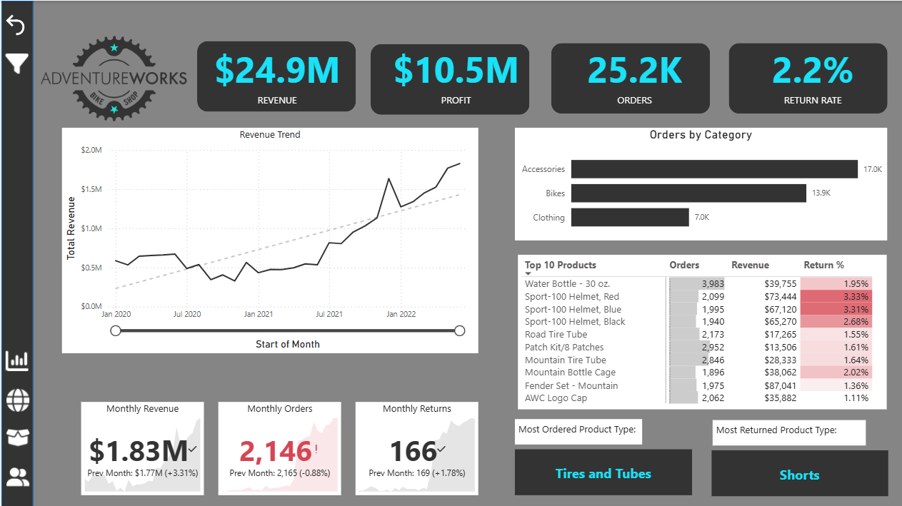
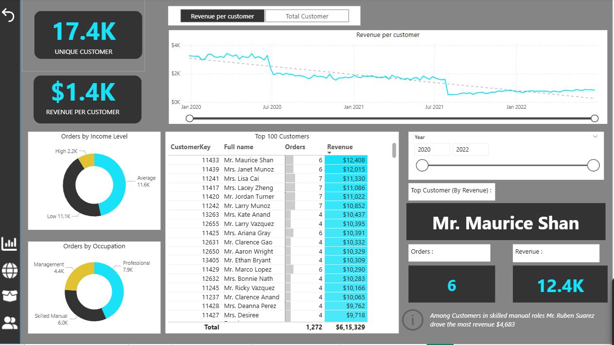
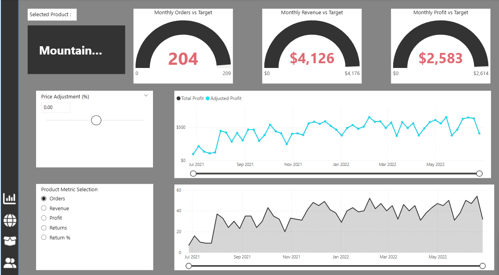
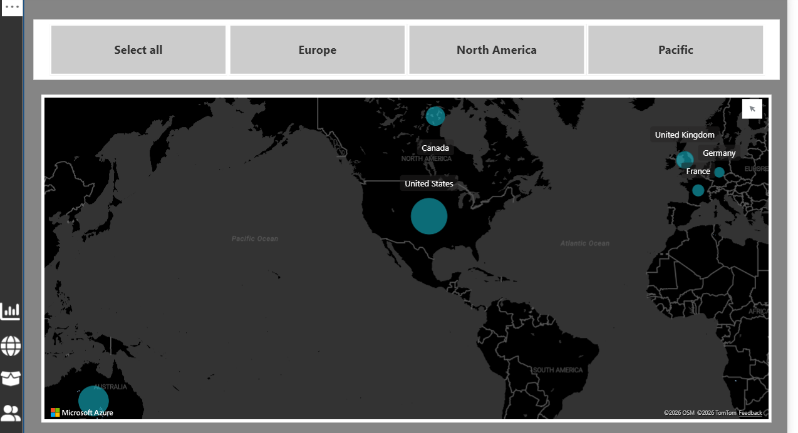

# AdventureWorks E-Commerce Analytics Dashboard
### Power BI · DAX · SQL · Business Intelligence

> A multi-page interactive analytics dashboard built on the AdventureWorks dataset, designed to surface actionable product, customer, and pricing insights for e-commerce decision-making.

---

## Project Overview

This project simulates the analytics workflow of an e-commerce business intelligence team. Rather than stopping at visualisation, the goal was to use data to answer real product and business questions — the kind that inform roadmap decisions, pricing strategy, and customer retention programs.
### Executive Summary


### Customer Analytics


### Product Detail


### Geographic Analysis



The dashboard is structured across four analytical lenses:

| Page | Focus | Key Question Answered |
|------|-------|----------------------|
| Executive Summary | Business KPIs & Revenue Trends | How is the business performing vs. prior periods? |
| Customer Analytics | Segmentation & Top Customers | Who are our highest-value users and what drives their behaviour? |
| Product Detail | SKU-level Performance & Price Simulation | Which products should we push, reprice, or deprioritise? |
| Geographic Analysis | Regional Sales Distribution | Where is revenue concentrated, and what's the expansion opportunity? |

---

## Key Business Metrics Tracked

| Metric | Value |
|--------|-------|
| Total Revenue | $24.9M |
| Total Profit | $10.5M |
| Total Orders | 25.2K |
| Return Rate | 2.2% |
| Unique Customers | 17.4K |
| Revenue per Customer | $1.4K |
| Monthly Revenue (latest) | $1.83M (+3.31% MoM) |
| Monthly Orders (latest) | 2,146 (-0.88% MoM) |
| Monthly Returns (latest) | 166 (+1.78% MoM) |

---

## Product Insights

**Page: Executive Summary**

- Revenue trend shows consistent growth from Jan 2020 to Jan 2022, with a dip-and-recovery pattern in mid-2021 — likely seasonal or supply-side.
- Accessories lead in order volume (17K orders), followed by Bikes (13.9K) and Clothing (7K) — suggesting accessories are the high-frequency, lower-ticket growth driver.
- Top returned product type: **Shorts** — flags a potential sizing/fit UX problem worth investigating.
- Most ordered product type: **Tires and Tubes** — a high-frequency replenishment category, ideal for subscription or re-order nudge features.

**Page: Product Detail**

- Built a dynamic **price adjustment simulator** using DAX what-if parameters — allows stakeholders to model revenue and profit impact of ±% price changes on any selected SKU before committing to a pricing decision.
- Monthly target tracking (Orders / Revenue / Profit) built using gauge visuals with KPI alerts — enables early identification of underperforming months.
- Mountain product line analysed in depth: orders trending upward June–July 2022 despite slight profit dip, suggesting volume growth at compressed margins.

---

## Customer Insights

**Page: Customer Analytics**

- **17.4K unique customers** segmented by income level and occupation.
- Income segmentation: High (2.2K), Average (11.6K), Low (11.1K) — the majority cluster in the Average segment, suggesting pricing strategy should optimise for this group.
- Occupation segmentation: Professional (7.9K), Skilled Manual (6.0K), Management (4.4K) — Professionals drive the highest order count and likely highest LTV.
- Top customer by revenue: **Mr. Maurice Shan** — $12,408 revenue across 6 orders, highlighting the outsized impact of a small high-value cohort.
- Among skilled manual customers: **Mr. Ruben Suarez** drove $4,683 in revenue — suggesting even lower-income segments have high-value outliers worth targeting.

**PM Hypothesis Generated:** The top 100 customers (by revenue) represent a disproportionate share of total business value. A loyalty or VIP program targeting this cohort could significantly improve retention and repeat purchase rate.

---

## Geographic Insights

**Page: Geographic Analysis**

- Revenue is heavily concentrated in the **United States**, with secondary markets in Canada, UK, Germany, France, and Australia.
- The US bubble dwarfs all other regions combined — a classic geographic revenue concentration risk.
- **Product Recommendation:** Regional expansion features (localised catalog, region-specific promotions) could reduce single-market dependency and unlock growth in underpenetrated European markets.

---

## Technical Implementation

### Tools & Technologies
- **Power BI Desktop** — dashboard design, interactivity, and publishing
- **DAX (Data Analysis Expressions)** — calculated columns, measures, KPIs, what-if parameters
- **Power Query (M language)** — data transformation and ETL pipeline
- **SQL** — initial data extraction and validation from relational schema

### DAX Measures Highlights

```DAX
-- Revenue per Customer
Revenue per Customer = DIVIDE([Total Revenue], [Unique Customers])

-- Month-over-Month Revenue Change
MoM Revenue % = 
DIVIDE(
    [Total Revenue] - CALCULATE([Total Revenue], DATEADD('Calendar'[Date], -1, MONTH)),
    CALCULATE([Total Revenue], DATEADD('Calendar', -1, MONTH))
)

-- Adjusted Profit (Price Simulation)
Adjusted Profit = 
[Total Profit] + 
SUMX(
    Sales,
    Sales[Order Quantity] * Sales[Product Cost] * 'Price Adjustment'[Price Adjustment Value]
)

-- Return Rate
Return Rate = DIVIDE([Total Returns], [Total Orders], 0)
```

### Data Model
- Star schema with a central `Sales` fact table
- Dimension tables: `Customers`, `Products`, `Calendar`, `Territory`
- Relationships managed via Power BI's model view with single-directional filters
- Bi-directional filtering applied selectively to avoid ambiguous filter paths

---

## PM Framing: What Product Decisions Does This Enable?

This dashboard was designed not just to display data, but to enable product and business decisions. Here's how each page maps to a real PM use case:

| Dashboard Section | PM Use Case |
|-------------------|-------------|
| Revenue Trend + MoM tracking | Sprint retrospective: is the product growing? Are we on track? |
| Return Rate per SKU | Feature prioritisation: which categories need UX/quality fixes? |
| Customer Segmentation | Persona building: who are our users, and how do we retain them? |
| Price Simulation | Pricing experiments: what's the revenue impact before we ship a change? |
| Geographic Concentration | Market expansion: where's the whitespace opportunity? |

---

## Key Learnings

1. **Data without decisions is just noise.** Every visualisation in this dashboard is anchored to a business question, not just a metric.
2. **The geographic concentration finding** (US dominates revenue) mirrors a real e-commerce product risk — over-reliance on a single market creates fragility. A PM would use this to justify a localisation roadmap item.
3. **Return rate is a product signal.** A 3.3% return rate on Sport-100 Helmets (Red) vs 1.1% on AWC Logo Cap suggests product-level issues — sizing guides, inaccurate descriptions, or expectation mismatch. This is a UX fix, not just a logistics problem.
4. **Price simulation ≠ pricing decisions.** The what-if parameter model is a starting point for A/B testing hypotheses, not a substitute for live experimentation.

---

## Dataset

**Source:** AdventureWorks sample dataset (Microsoft)
**Domain:** Retail / E-commerce (Bicycle & accessories)
**Records:** ~25K+ transaction rows across 2020–2022
**Note:** This is a publicly available sample dataset used for analytics practice. All business insights are illustrative.

---

## Project Structure

```
adventureworks-powerbi/
│
├── AdventureWorks_Dashboard.pbix     # Main Power BI file
├── README.md                         # This file
├── screenshots/
│   ├── executive_summary.png
│   ├── customer_analytics.png
│   ├── product_detail.png
│   └── geographic_analysis.png
└── data/
    └── (source CSV files if applicable)
```

---

## How to Use

1. Download and open `AdventureWorks_Dashboard.pbix` in Power BI Desktop (free)
2. Navigate between pages using the left sidebar
3. Use the **date range sliders** to filter by time period
4. On the Product Detail page, use the **Price Adjustment slider** to simulate pricing scenarios
5. On the Customer page, use the **Year slicer** to compare cohorts across 2020–2022

---

## Contact

Built by **Ashutosh** · [LinkedIn](linkedin.com/in/ashutoshhdevv) · [GitHub](https://github.com/devv-ashutosh)

*Part of a broader analytics portfolio focused on product-driven data analysis.*
